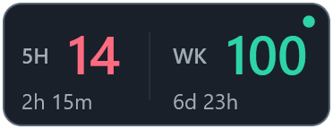

## 本地修改：浮窗位置与额度列

- 右键 **Scale** 可选择 50%～300% 等比例缩放；文字、图形与圆角使用 WPF 矢量缩放。比例保存为 settings.json 的 window_scale（默认 1.0）。
- 卡片圆角、玻璃装饰和托盘额度环使用 WPF 原生矢量绘制与抗锯齿，移除手写 4 倍采样和位图缩小流程；托盘图标仅在交给 Windows 时按目标尺寸输出位图。
- 窗口边角透明，拖动使用系统原生流程；不再启用原生毛玻璃背景。

- 默认显示在主屏工作区右下角，与右边和下边各留 10 像素，避开任务栏。
- 按住鼠标左键拖动浮窗，松开后自动保存位置；重启后恢复。屏幕断开或分辨率变化时会限制在可见工作区。
- 右键选择 **Reset position to bottom right**，清除保存的位置并恢复默认位置。
- 成功查询且 fiveHour 为空时隐藏 5H 列，同时收窄窗口；后续返回 5H 时自动恢复。查询失败保留上次有效数据与列布局。
- settings.json 新增可选的 window_x、window_y（屏幕物理像素坐标）；两者为空时使用默认位置。window_width 仍代表三列宽度。
- 以下上游说明与截图中的“任务栏左侧贴靠”和“5H inactive”行为已被本节替代。

  
  <h1>Codex 用量监控</h1>
  
<strong>C# WPF 原生版</strong> · Windows 桌面版 Codex 的紧凑任务栏额度浮窗

这是一个面向 Windows 桌面版 Codex 的轻量常驻工具。它固定覆盖在主任务栏左侧，以与任务栏相同的高度显示短周期额度、一周额度和本地刷新状态，不额外占用桌面工作区。

本项目不是 Codex CLI 的通用封装器或替代入口。程序会调用 Windows 桌面版 Codex 随附的本机 `codex.exe app-server`，用户侧用途仍是观察桌面版 Codex 的额度状态。

本项目由 OpenAI Codex 协助开发，但不是 OpenAI 官方项目。项目主要为个人自用，除严重或破坏性 bug 外，不承诺后续维护、兼容性支持或功能请求响应。仓库未提供开源许可证；公开可见不等于主动授予复用权利。

## 界面与功能

- 双额度默认宽度约 124px，单周额度约 70px，高度直接采用 Windows 主任务栏的实际高度。
- 固定在任务栏左侧并保持置顶；任务栏位置或尺寸变化后会自动重新贴靠。
- 默认使用普通深色配色；右键 **Glass effect / 玻璃效果** 可开关玻璃装饰层，立即生效并保存为 `glass_effect`（默认 `false`）。反光和高光位于底色之上、额度内容之下，不修改底色、文字或布局，也不拦截鼠标。窗口不出现在任务栏应用列表。
- 托盘图标随额度动态更新：内圈代表 5H，外圈代表周额度，弧长表示剩余比例，颜色沿用额度阈值。无数据时对应圈显示灰色虚线，0% 显示空轨道；刷新失败时保留上次读数，悬停查看百分比与刷新状态。左键刷新、右键菜单及退出行为不变；单实例运行。
- 刷新失败时保留最后一次有效读数，并通过右上角的小状态点提示：绿色正常，黄色表示旧数据或更新过期，红色表示读取失败且无可用数据，灰色表示等待首次更新。

界面采用紧凑数字布局：5H 与 WK 的剩余百分比靠近标签，倒计时在下方；5H 三位数字会适度压窄，窗口不会随读数跳动。`window_width` 保留旧配置基准（默认 260），实际宽度按双额度 124px / 单周额度 70px 换算；缩放仍可通过菜单调整。

界面元素的含义：

- **5H**：约 5 小时短周期额度的剩余百分比及重置倒计时。如果服务端当前未提供该窗口，隐藏 5H 并收窄为单周额度布局，不会拿其他窗口的数据代替。
- **WK**：一周额度窗口的剩余百分比及重置倒计时。
- **右上角状态点**：直径约 4.5px，两项额度共用；刷新过程中不闪烁。悬停查看上次成功时间、距今多久、正在刷新及失败原因。

窗口和托盘共用同一组右键操作：

- **Refresh now**：立即读取一次额度。
- **Snap to taskbar left**：立即重新贴靠到主任务栏左侧。
- **Quota interval**：将自动刷新间隔设置为 1、3、5、10 或 15 分钟。
- **Exit**：退出窗口、托盘图标和后台进程。

## 安装与运行

推荐从 [GitHub Releases](https://github.com/xiaominga/CodexQuotaMonitor/releases) 下载最新版本的 `CodexQuotaMonitor-Setup-<版本号>.msi`，双击即可安装。安装向导支持修改安装目录，并提供以下选项：

- **Create a desktop shortcut**：创建桌面快捷方式，默认选中。
- **Launch Codex Quota Monitor**：安装完成后立即启动，在完成页显示，默认不选中。

安装包包含 .NET 运行时，目标电脑不需要另行安装 .NET Desktop Runtime。`1.1.1` 及之后的安装包支持检测并升级同一产品的旧版本。

也可以下载自包含的 `CodexQuotaMonitor.Wpf.exe` 直接运行。该 EXE 同样不依赖目标电脑预装 .NET。

当前发布产物未使用商业代码签名证书。Windows SmartScreen 可能对首次下载的 MSI 或 EXE 显示来源未知提示；请从本仓库的 Releases 页面获取文件，并自行核对发布来源。

运行前需要：

- Windows 10/11 x64。
- Windows 桌面版 Codex 已安装并已登录。
- 程序能够从桌面版安装位置或 `PATH` 找到 `codex.exe`；诊断时也可用 `--codex-exe` 显式指定。

## 查询原理与风险

额度查询会启动本机 `codex.exe app-server --listen stdio://`，再通过 JSON-RPC 调用 `account/rateLimits/read`。程序依据服务端返回的 `windowDurationMins` 识别额度窗口：约 `300` 分钟归入 **5H**，约 `10080` 分钟归入 **WK**，而不是假定 `primary` 一定代表 5H。

程序不读取 `auth.json` 中的 token，也不自行把账号数据发送到第三方服务。状态点悬浮提示中的更新时间是本组件最近一次成功完成额度读取的本地时间，不是 OpenAI 服务端时间。

需要注意：

- `codex.exe app-server` 不是面向本项目承诺稳定性的公开接口；桌面版 Codex 更新后，方法名、字段或窗口类型可能变化。
- 读数依赖本机 Codex 的登录状态和网络；账号切换、登录失效或网络异常都可能使刷新失败。
- 服务端可能临时停用某类额度窗口，此时对应区域会显示不可用。
- 剩余百分比和重置时间来自 Codex 返回值，只适合作为日常参考。
- 本地日志可能包含文件路径和错误信息，不应直接提交到公开仓库。

## 本地设置

安装版默认把状态文件写入：

~~~text
%LOCALAPPDATA%\CodexQuotaMonitor\settings.json
%LOCALAPPDATA%\CodexQuotaMonitor\logs\codex_quota_monitor.log
~~~

从源码目录运行时，`Start-CodexQuotaMonitorNative.cmd` 会把状态保存在项目根目录。环境变量 `CODEX_QUOTA_MONITOR_NATIVE_HOME` 可显式覆盖状态目录。

`settings.example.json` 中的默认值：

~~~json
{
  "quota_interval": 180,
  "no_tray": false,
  "glass_effect": false,
  "window_width": 260,
  "red_threshold": 15.0,
  "amber_threshold": 30.0
}
~~~

## 从源码运行

源码构建需要 .NET 8 SDK。普通启动：

~~~cmd
Start-CodexQuotaMonitorNative.cmd
~~~

诊断和单次读取：

~~~cmd
Start-CodexQuotaMonitorNative.cmd --check --no-tray
Start-CodexQuotaMonitorNative.cmd --once --no-tray
~~~

支持的参数：

- **--check**：输出环境、状态目录和任务栏贴靠位置，不启动 GUI。
- **--once**：读取一次额度并输出 JSON，不启动 GUI。
- **--codex-home &lt;path&gt;**：指定 Codex home，默认使用 `%CODEX_HOME%` 或 `~/.codex`。
- **--codex-exe &lt;path&gt;**：指定 `codex.exe`。
- **--quota-interval &lt;seconds&gt;**：覆盖额度刷新间隔。
- **--tray / --no-tray**：覆盖托盘图标开关。

## 构建发布包

版本号统一维护在 `Directory.Build.props`，当前待发布版本为 **1.3.0**。本地构建运行：

~~~powershell
pwsh -NoProfile -File .\Build-Release.ps1
~~~

脚本会生成：

~~~text
publish\win-x64-self-contained\CodexQuotaMonitor.Wpf.exe
publish\installer\CodexQuotaMonitor-Setup-1.3.0.msi
publish\release\CodexQuotaMonitor.Wpf.exe
publish\release\CodexQuotaMonitor-Setup-1.3.0.msi
publish\release\SHA256SUMS
~~~

构建机需要 Windows、PowerShell 7 和 .NET 8 SDK（或可构建 .NET 8 项目的更新 SDK），并会通过 NuGet 获取 WiX；WiX 只用于生成 MSI，终端用户不需要安装 WiX。脚本核对 EXE/MSI 版本、MSI 升级标识和 SHA256，`publish/release` 只包含三个发布附件。可使用 `-OutputRoot .\artifacts\package-check` 指定仓库内的独立输出目录；兼容保留的 `-Version` 参数必须与 `Directory.Build.props` 一致。

基础验证命令：

~~~cmd
dotnet build .\src\CodexQuotaMonitor.Wpf\CodexQuotaMonitor.Wpf.csproj -c Release
dotnet run --project .\tests\CodexQuotaMonitor.Tests\CodexQuotaMonitor.Tests.csproj -c Release
~~~

## GitHub 自动构建与发布

工作流为 `.github/workflows/build-release.yml`，运行在 `windows-2022`，安装 .NET 8 SDK。所有构建先运行回归测试，再打包和验证 EXE、MSI 与 SHA256；不需要 Codex 登录信息，也不进行真实额度查询。

| 触发方式 | 结果 |
| --- | --- |
| 推送 `native-wpf`、向该分支提交 PR | 测试、打包，在 Actions 中保存 14 天的构建附件 |
| Actions → Build and release → Run workflow | 手动测试和打包，不创建 Release |
| 推送 `v主版本.次版本.修订号` 标签 | 完成上述检查，再创建带三个附件的 Release 草稿 |

首次使用：在仓库 **Settings → Actions → General** 确认已启用 GitHub Actions，并允许工作流使用 `actions/checkout`、`actions/setup-dotnet`、`actions/upload-artifact`、`actions/download-artifact` 和 `actions/github-script`。工作流使用内置 `GITHUB_TOKEN`；只有创建草稿的 job 申请 `contents: write`，无需配置个人 PAT、Codex token 或其他 Secret。组织策略如禁止写权限，需要仓库管理员放行。

发布 **v1.3.0** 的操作：

1. 将本次工作流、版本文件、脚本和发布说明提交并推送到 `native-wpf`。在 [Actions](https://github.com/xiaominga/CodexQuotaMonitor/actions) 确认该提交的 **Build and release** 成功。可先下载 `CodexQuotaMonitor-1.3.0-win-x64` 附件验证实际运行和 MSI 升级。
2. 在包含这些文件的提交上创建并推送标签（以下命令在项目目录执行，每条成功后再执行下一条）：

   ~~~powershell
   git switch native-wpf
   git pull --ff-only origin native-wpf
   git tag -a v1.3.0 -m "Release v1.3.0"
   git push origin v1.3.0
   ~~~

3. 等待标签触发的 Actions 成功，在 [Releases](https://github.com/xiaominga/CodexQuotaMonitor/releases) 打开 **v1.3.0 草稿**，核对说明和 EXE、MSI、SHA256SUMS 三个附件，点击 **Publish release**。只有此时版本才正式公开。

标签必须与 `Directory.Build.props` 中的版本完全一致，并指向 `native-wpf` 分支历史中的提交；发布说明来自 `release-notes/v1.3.0.md`。后续发布只需更新 `Directory.Build.props`、新增对应 `release-notes/v<版本号>.md`，再按相同步骤提交、测试和推送新标签。

失败处理：测试或打包失败不会创建草稿；上传失败可能留下不完整草稿，排除网络或权限问题后可在 Actions 中 **Re-run failed jobs**，工作流会补传或替换草稿附件。若需要修改源码，应提交修复后使用新版本和标签。已公开 Release 的附件不会被此工作流覆盖，也不要强制移动旧标签。

下载后可用 `Get-FileHash .\CodexQuotaMonitor.Wpf.exe -Algorithm SHA256` 和 `Get-FileHash .\CodexQuotaMonitor-Setup-1.3.0.msi -Algorithm SHA256` 对照 `SHA256SUMS`。构建与包结构检查不替代真实桌面显示、账号额度查询或从旧版安装升级的验证。

## 分支关系

本分支是 C# WPF 原生 Windows 版本，提供自包含 EXE、MSI、原生托盘和紧凑任务栏浮窗。同一仓库的 `python-tk` 分支保留 Python/Tk 实现：它更方便阅读和修改，但需要用户自行准备 Python，并通过 `python codex_quota_float.py` 运行。

## 公开仓库注意事项

`.gitignore` 已排除本地设置、日志和构建产物。公开提交前仍应确认没有包含：

- `settings.json`
- `logs/`
- `publish/`
- `src/**/bin/`、`src/**/obj/`
- `installer/**/bin/`、`installer/**/obj/`
- 个人路径、token、key、账户信息或运行日志
